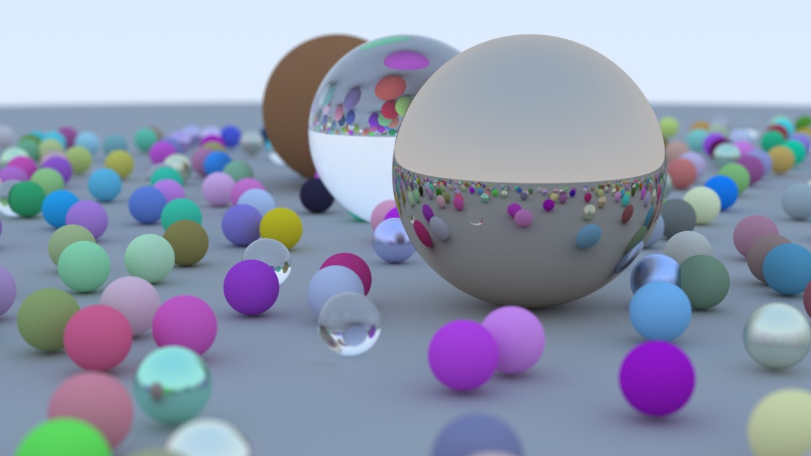
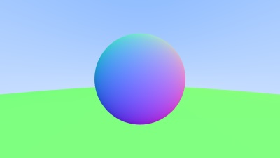
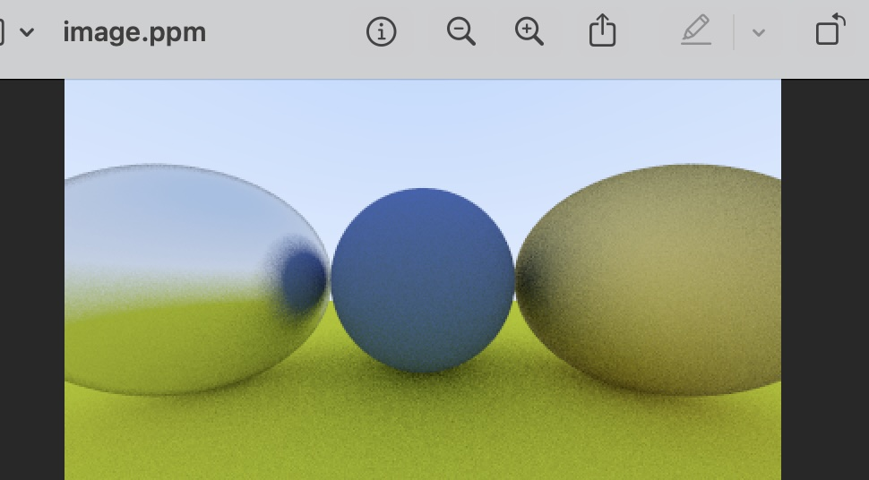

## Ray Tracing in Rust

Got really into Arcane and started learning about computer graphics lol, so I made a simple ray tracer in Rust.

LOOK HOW COOL i am so happy 

*(This took a few hours to fully render so I will need to speed it up a lot...)*

The evolution if you're curious...

### Resources

Used https://raytracing.github.io/ (very good).

### TODO

- [ ] Add fun materials (like swirly glass)
- [ ] Add confirgurable camera 
- [ ] Speed up rendering & performance
- [ ] Maybe add a scene editor UI??